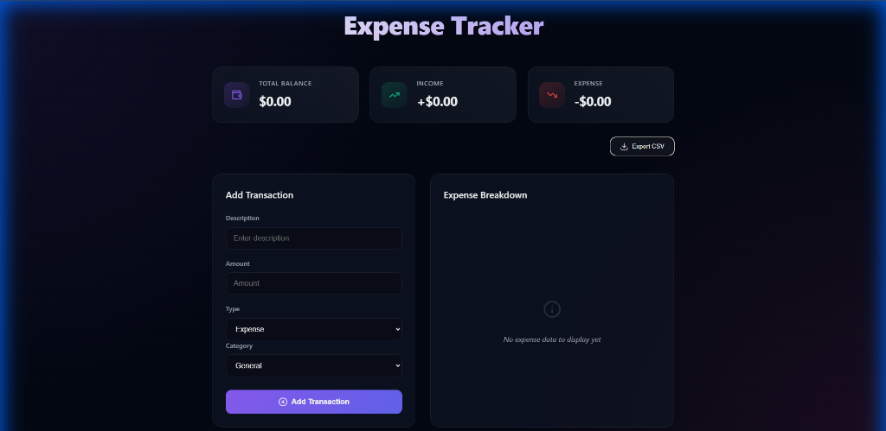

# Expense Tracker Pro

## Description
A premium, highly interactive Expense Tracker application designed to help users manage their finances with ease. Featuring real-time dashboard updates, advanced data visualization, and a sleek glassmorphism UI.

## Tech Stack
- **Frontend:** React, Vite
- **Animations:** Framer Motion
- **Charts:** Recharts
- **Icons:** Lucide React
- **Storage:** Local Browser Storage

## Features
- **Dynamic Dashboard:** Real-time summary of balance, income, and expenses.
- **Advanced Visualizations:** Switch between Pie, Bar, and Trend (Candle-like) charts to analyze spending habits.
- **Glassmorphism UI:** Modern, engaging design with smooth transitions and premium aesthetics.
- **Transaction Management:** Easily add, track, and delete income or expense items.
- **Data Export:** Export your transaction history to CSV for external analysis.

## Screenshots



## Live Demo
[https://expence-tracker-virid-two.vercel.app/]
## Setup Instructions
```bash
# Install dependencies
npm install

# Run the development server
npm run dev

# Build for production
npm run build
```
